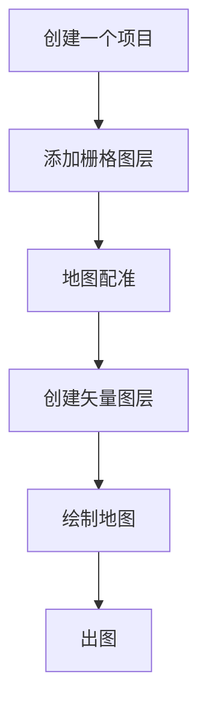

# 制图的开始

## Qgis的操作界面

### 菜单栏

制图所需要的基本工具都在这里，例如：

打开、保存、配准、矢量图层编辑、栅格图层编辑

### 工具栏

高级操作所需工具，例如：

矢量图层裁剪、合并、数据库处理

### 浏览器

管理文件

添加在线资源

### 制图栏

主要操作区域

### 图层栏

管理不同图层

栅格图（地图）

矢量图层：点、线、面

## Qgis的制图的基本概念

### 项目

一切制图的开始

无论绘制什么地图，首先需要建立Project（项目）

文件格式为“.qgz”

### 图层

图层分为两种：栅格图层、矢量图层

#### 栅格图册：绘制矢量地图的数据来源，包括：老地图、航拍图片等等

格式一般为.tiff、.png、.img等等

#### 矢量图层：俗称“电子地图”，即根据栅格图层绘制而成的电子地图

矢量图层的特点，不受分辨率的影响，可以无线放大、缩小，可以进行空间统计和计算

Qgis的矢量图层，一般由5个文件构成：.cpg、.dbf、.prj、.shp、.shx。

5个文件，缺一不可，在复制和粘贴的时候，务必注意

## 制图的程序

## 制图的注意事项

### 坐标系的选择

一般选择:WSG84/EPSG:4326

如果使用在线栅格资源，则需要考虑资源的坐标系统

坐标系统一旦选定，须保持统一，即所有图层，无论栅格图还是矢量图，都需要保持一致

坐标系统可以更改，但可能会造成一些误差

### 地图配准

栅格地图可以分为两种：有空间数据的和没有空间数据的

带有空间数据的栅格地图，可以直接用于矢量图的绘制

缺乏空间数据的栅格图，则需要先赋予它空间信息，这个过程被称为地图配准

### 如何进行地图配准

#### 选择足够的定位点

最少4个，多多益善

定位点的分布，尽量平均分布在地图的东南西北4个角上

#### 定位点的选择

应选择空间变化较小的地方，如：

名山大川、著名建筑、重要地标

这样做的目的是便于将地图上的点与现实中的点联系起来

#### 在线资源的选择

openstreetmap： https://tile.openstreetmap.org/{z}/{x}/{y}.png

高德地图：  https://webrd02.is.autonavi.com/appmaptile?lang=zh_cn&size=1&scale=1&style=8&x={x}&y={y}&z={z}

#### 地图定位的正确设定

-   线性

- 最临近

